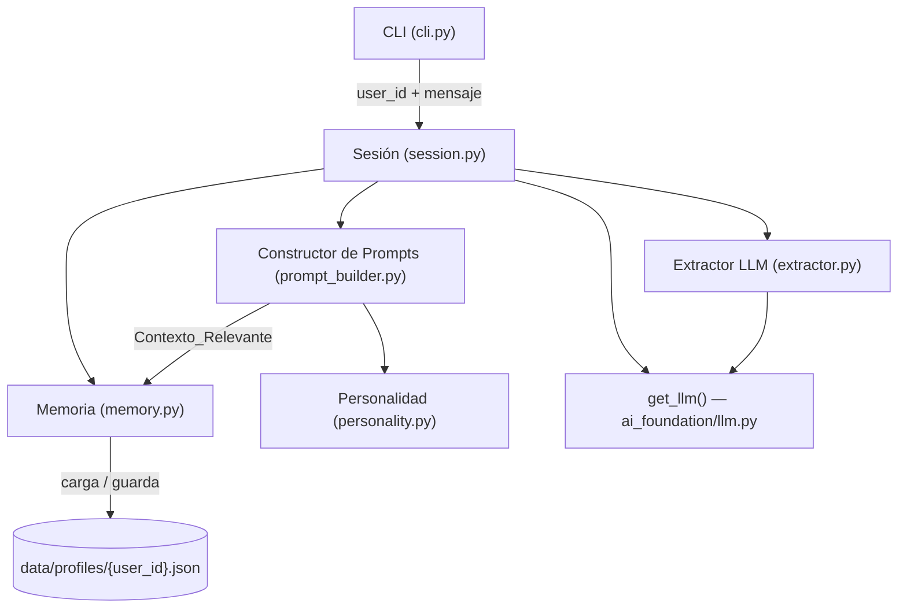
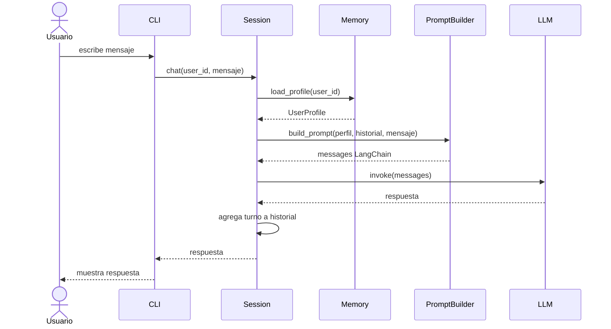
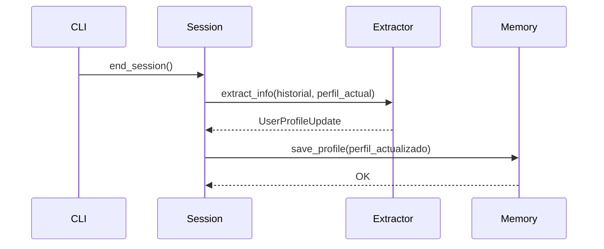

# Documento de Diseño Técnico: AI Companion

## Visión General

El AI Companion es un acompañante conversacional con personalidad propia y memoria persistente, construido sobre la infraestructura existente del proyecto (`src/ai_foundation`). Su diferenciador clave frente a un chatbot genérico es la capacidad de recordar a cada usuario entre sesiones —nombre, preferencias, eventos importantes— y responder de forma cálida, empática y coherente con su carácter en todas las interacciones.

### Objetivos de diseño

- **Persistencia real de identidad**: el Companion conoce a cada usuario, no solo a la sesión activa.
- **Personalidad consistente**: el tono, el humor y la empatía se mantienen sesión tras sesión.
- **Extracción automática de contexto**: el sistema aprende del usuario sin requerir formularios explícitos.
- **Integración no invasiva**: se apoya en `get_llm()` y `settings` ya existentes; no duplica infraestructura.
- **Testabilidad**: la lógica de negocio (serialización, extracción, construcción de prompts) está desacoplada de la I/O.

### Alcance

El sistema se compone de cuatro módulos principales:

| Módulo | Responsabilidad |
|---|---|
| `memory` | Almacenamiento, carga y serialización de perfiles |
| `personality` | Definición y construcción del system prompt del Companion |
| `session` | Orquestación de un turno completo de conversación |
| `cli` | Interfaz de línea de comandos para el usuario final |

---

## Arquitectura

### Diagrama de componentes



### Flujo de un turno de conversación



### Flujo de fin de sesión (extracción + persistencia)



---

## Componentes e Interfaces

### `src/ai_companion/memory.py`

Responsable de la persistencia del `UserProfile` en JSON.

```python
class Memory:
    def __init__(self, profiles_dir: Path = Path("data/profiles")) -> None: ...

    def load_profile(self, user_id: str) -> UserProfile:
        """Carga el perfil desde disco. Si no existe o está corrupto, retorna un perfil vacío."""

    def save_profile(self, profile: UserProfile) -> None:
        """Serializa el perfil a JSON con UTF-8 en data/profiles/{user_id}.json."""
```

### `src/ai_companion/personality.py`

Define la personalidad del Companion como un system prompt base inmutable.

```python
def get_system_prompt(profile: UserProfile) -> str:
    """Construye el system prompt completo combinando la personalidad base con
    el contexto relevante del perfil del usuario."""
```

### `src/ai_companion/prompt_builder.py`

Combina personalidad, Contexto_Relevante e historial en la lista de mensajes para LangChain.

```python
def build_messages(
    profile: UserProfile,
    history: list[Turn],
    user_message: str,
) -> list[BaseMessage]:
    """Retorna la lista de mensajes lista para invocar el LLM."""
```

### `src/ai_companion/extractor.py`

Usa el LLM para analizar el historial de la sesión y extraer información del usuario.

```python
async def extract_user_info(
    history: list[Turn],
    current_profile: UserProfile,
    llm: BaseChatModel,
) -> UserProfileUpdate:
    """Extrae nombre, preferencias y eventos del historial.
    Retorna un UserProfileUpdate con solo los campos a modificar."""
```

### `src/ai_companion/session.py`

Orquestador principal: mantiene el historial de la sesión activa y coordina todos los componentes.

```python
class CompanionSession:
    def __init__(self, user_id: str, memory: Memory, llm: BaseChatModel) -> None: ...

    def chat(self, message: str) -> str:
        """Procesa un mensaje del usuario y retorna la respuesta del Companion."""

    def end_session(self) -> None:
        """Extrae información del historial y persiste el perfil actualizado."""
```

### `src/ai_companion/cli.py`

Interfaz de línea de comandos. Lee stdin, llama a `CompanionSession.chat()` y escribe en stdout.

```python
def run_cli() -> None:
    """Punto de entrada principal del CLI interactivo."""
```

---

## Modelos de Datos

Todos los modelos de datos usan **Pydantic v2**, alineado con la infraestructura existente del proyecto.

### `UserProfile`

```python
from datetime import datetime
from pydantic import BaseModel, Field


class ImportantEvent(BaseModel):
    description: str
    date_mentioned: datetime
    updated_at: datetime = Field(default_factory=datetime.utcnow)


class UserPreferences(BaseModel):
    likes: list[str] = Field(default_factory=list)
    dislikes: list[str] = Field(default_factory=list)
    interests: list[str] = Field(default_factory=list)


class UserProfile(BaseModel):
    user_id: str
    name: str | None = None
    preferences: UserPreferences = Field(default_factory=UserPreferences)
    important_events: list[ImportantEvent] = Field(default_factory=list)
    discussed_topics: list[str] = Field(default_factory=list)
    created_at: datetime = Field(default_factory=datetime.utcnow)
    updated_at: datetime = Field(default_factory=datetime.utcnow)
```

### `Turn`

```python
class Turn(BaseModel):
    user_message: str
    companion_response: str
    timestamp: datetime = Field(default_factory=datetime.utcnow)
```

### `UserProfileUpdate`

DTO que porta únicamente los campos a fusionar en el perfil existente (resultado del extractor):

```python
class UserProfileUpdate(BaseModel):
    name: str | None = None
    new_likes: list[str] = Field(default_factory=list)
    new_dislikes: list[str] = Field(default_factory=list)
    new_interests: list[str] = Field(default_factory=list)
    new_events: list[ImportantEvent] = Field(default_factory=list)
    new_topics: list[str] = Field(default_factory=list)
```

### Ventana de contexto corto plazo

La `CompanionSession` mantiene internamente `history: list[Turn]` con un máximo de **20 turnos** (FIFO). Este límite está definido como constante:

```python
MAX_HISTORY_TURNS: int = 20
```

### Formato de archivo JSON en disco

Ejemplo de `data/profiles/alice.json`:

```json
{
  "user_id": "alice",
  "name": "Alice",
  "preferences": {
    "likes": ["fotografía", "café de especialidad"],
    "dislikes": ["madrugadas"],
    "interests": ["diseño gráfico", "viajes"]
  },
  "important_events": [
    {
      "description": "Cumpleaños el 15 de agosto",
      "date_mentioned": "2025-07-01T10:00:00",
      "updated_at": "2025-07-01T10:00:00"
    }
  ],
  "discussed_topics": ["diseño", "trabajo freelance"],
  "created_at": "2025-06-01T09:00:00",
  "updated_at": "2025-07-01T10:00:00"
}
```

---

## Propiedades de Corrección

*Una propiedad es una característica o comportamiento que debe cumplirse en todas las ejecuciones válidas del sistema — esencialmente, un enunciado formal sobre lo que el software debe hacer. Las propiedades sirven de puente entre las especificaciones legibles por humanos y las garantías de corrección verificables por máquina.*

### Propiedad 1: Ida y vuelta de serialización del perfil

*Para todo* `UserProfile` válido, serializarlo a JSON y luego deserializarlo SHALL producir un objeto equivalente al original, con todos los campos correctamente tipados.

**Valida: Requisito 7.4**

---

### Propiedad 2: Perfil vacío ante JSON inválido o faltante

*Para cualquier* `user_id` cuyo archivo JSON no exista o contenga datos corruptos / campos faltantes, `Memory.load_profile()` SHALL retornar un `UserProfile` válido con valores por defecto, sin lanzar excepciones.

**Valida: Requisitos 1.7, 7.3**

---

### Propiedad 3: Ventana deslizante del historial

*Para cualquier* sesión con más de 20 turnos, la `Memoria_a_Corto_Plazo` SHALL contener exactamente los 20 turnos más recientes (los más antiguos son descartados), y la longitud nunca SHALL superar ese límite.

**Valida: Requisito 2.2**

---

### Propiedad 4: El prompt incluye el historial completo de la sesión activa

*Para cualquier* lista de turnos no vacía (dentro del límite de 20), `build_messages()` SHALL producir una lista de mensajes LangChain que contenga exactamente un `HumanMessage` y un `AIMessage` por cada turno del historial, en el orden correcto.

**Valida: Requisito 2.3**

---

### Propiedad 5: La extracción no corrompe el perfil original

*Para cualquier* `UserProfile` y cualquier `UserProfileUpdate` resultante de la extracción, la fusión de ambos SHALL preservar todos los campos preexistentes del perfil, añadiendo únicamente los datos nuevos (sin borrar ni sobrescribir entradas ya existentes, excepto el nombre si se detecta uno nuevo).

**Valida: Requisito 8.2**

---

### Propiedad 6: El campo `updated_at` avanza con cada actualización

*Para cualquier* `UserProfile`, tras aplicar un `UserProfileUpdate` no vacío, el campo `updated_at` del perfil resultante SHALL ser mayor o igual al `updated_at` del perfil original.

**Valida: Requisito 8.4**

---

## Manejo de Errores

| Escenario | Comportamiento |
|---|---|
| Archivo de perfil no encontrado | `Memory.load_profile()` retorna perfil vacío; log `WARNING` |
| JSON malformado al cargar perfil | Igual que arriba; log `ERROR` con detalle de excepción |
| Timeout del LLM (>10 s) | `CompanionSession.chat()` captura la excepción y retorna mensaje amigable; log `ERROR` |
| Error interno durante extracción | `end_session()` registra el error en log y guarda el perfil sin modificaciones en los campos extraídos |
| Error de escritura al guardar perfil | Log `ERROR`; la sesión puede continuar pero el usuario es notificado de que los cambios no fueron persistidos |
| Campos desconocidos en JSON | Pydantic `extra="ignore"` descarta campos desconocidos sin fallar |

**Principio general**: el Companion nunca debe romper la conversación del usuario por un error de I/O. Los errores de infraestructura se registran pero no se propagan hasta la CLI como excepciones no manejadas.

---

## Estrategia de Pruebas

### Enfoque dual

Se combinan pruebas unitarias de ejemplo con pruebas basadas en propiedades (PBT) usando la biblioteca **Hypothesis**, ya incluida en las dependencias de desarrollo del proyecto (`pyproject.toml`).

### Pruebas unitarias (ejemplo-based)

- **`tests/test_memory.py`**: carga de perfil existente, perfil no encontrado, JSON malformado, guardar y recargar.
- **`tests/test_prompt_builder.py`**: prompt con perfil vacío, prompt con historial parcial, prompt con evento próximo.
- **`tests/test_session.py`**: ventana de 20 turnos (borde exacto y borde + 1), flujo completo de `chat()` con LLM mockeado.
- **`tests/test_extractor.py`**: extracción con historial vacío, extracción no borra datos previos, fusión de campos.
- **`tests/test_cli.py`**: comandos `/salir`, `/exit`, `/quit` terminan la sesión; manejo de error amigable.

### Pruebas de propiedad (Hypothesis)

Cada propiedad del documento tiene **un único test** de propiedad, configurado con mínimo **100 iteraciones** (por defecto en Hypothesis). Tag de referencia obligatorio en cada test:

```
# Feature: ai-companion, Propiedad N: <texto de la propiedad>
```

| Test | Propiedad | Módulo |
|---|---|---|
| `test_profile_serialization_roundtrip` | Propiedad 1 | `tests/test_memory.py` |
| `test_load_invalid_profile_returns_default` | Propiedad 2 | `tests/test_memory.py` |
| `test_history_window_never_exceeds_20` | Propiedad 3 | `tests/test_session.py` |
| `test_build_messages_includes_all_history` | Propiedad 4 | `tests/test_prompt_builder.py` |
| `test_merge_preserves_existing_fields` | Propiedad 5 | `tests/test_extractor.py` |
| `test_updated_at_advances_on_update` | Propiedad 6 | `tests/test_extractor.py` |

**Configuración de Hypothesis** en `pyproject.toml`:

```toml
[tool.hypothesis]
max_examples = 100
```

### Decisión: ¿por qué PBT aplica aquí?

Las funciones de serialización (`UserProfile → JSON → UserProfile`), la lógica de ventana deslizante del historial, y la fusión de perfiles son funciones puras con un espacio de entrada grande y propiedades universales verificables. El costo de 100 iteraciones es mínimo (sin llamadas a APIs externas). El LLM se mockea en todos los tests de propiedad.
