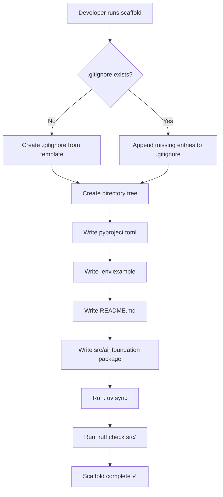

# Design Document

## Feature: ai-project-foundation

---

## Overview

This document describes the technical design for generating the foundational repository scaffold for an LLM and AI Agentic systems project. The scaffold is a one-time, deterministic generation step that produces a fully configured Python project directory ready for LLM-powered development.

**Key design goals:**

- Produce a reproducible, opinionated project layout that follows Python packaging best practices (PEP 517/621, `src` layout)
- Use `uv` as the package manager for its speed, lockfile support, and all-in-one virtual environment management
- Pre-configure `ruff` for linting and formatting, eliminating the need for multiple tools (black, isort, flake8)
- Expose a typed `Settings` class via `pydantic-settings` so environment variables are validated at startup
- Provide an initial `src/ai_foundation/` package with a config module, LLM factory, and structured logging — reducing setup friction for new features

**Research findings that inform this design:**

- `uv` ([astral.sh/uv](https://astral.sh/uv)) replaces pip, venv, pip-tools, and pyenv with a single Rust binary. It generates a `uv.lock` cross-platform lockfile, making `requirements.txt` largely unnecessary for pure `uv` workflows. Both `uv.lock` and a generated `requirements.txt` will be included to satisfy the requirement and support non-`uv` toolchains.
- `pydantic-settings` (the dedicated `pydantic-settings` package, separate from `pydantic` core since v2) provides `BaseSettings` with automatic environment variable loading and `.env` file support, making `python-dotenv` complementary but not required for the Settings class itself. Both will be declared.
- `ruff` ([docs.astral.sh/ruff](https://docs.astral.sh/ruff)) handles linting (E, F, I rules) and formatting in a single tool with millisecond execution times. Configured via `[tool.ruff]` in `pyproject.toml`.
- LangGraph application structure ([docs.langchain.com](https://docs.langchain.com/oss/python/langgraph/application-structure)) recommends a `src/`-based layout with graph definitions separated from orchestration logic, aligning with the `agents/` top-level directory.

---

## Architecture

The scaffold is a **code generation** process: a generator script (or Kiro task execution) creates the required files and directories from templates/specifications. Once generated, the scaffold is a static Python project with no runtime generator component.



The generated project follows a **src layout**, which separates importable packages from the project root and prevents accidental imports of uninstalled packages during development.

```
project-root/
├── src/
│   └── ai_foundation/
│       ├── __init__.py
│       ├── config.py
│       ├── llm.py
│       └── utils/
│           ├── __init__.py
│           └── logging.py
├── agents/
│   └── .gitkeep
├── notebooks/
│   └── .gitkeep
├── data/
│   ├── raw/        (.gitkeep)
│   ├── processed/  (.gitkeep)
│   └── outputs/    (.gitkeep)
├── configs/
│   └── .gitkeep
├── tests/
│   └── .gitkeep
├── docs/
│   └── .gitkeep
├── scripts/
│   └── .gitkeep
├── pyproject.toml
├── uv.lock          (generated by uv sync)
├── requirements.txt (exported from uv.lock)
├── .env.example
├── .gitignore
└── README.md
```

---

## Components and Interfaces

### 1. Directory Scaffold

**Responsibility:** Create all top-level directories and their `.gitkeep` placeholders.

Directories created: `src/`, `src/ai_foundation/`, `src/ai_foundation/utils/`, `agents/`, `notebooks/`, `data/`, `data/raw/`, `data/processed/`, `data/outputs/`, `configs/`, `tests/`, `docs/`, `scripts/`.

Empty directories that require `.gitkeep`: `agents/`, `notebooks/`, `data/raw/`, `data/processed/`, `data/outputs/`, `configs/`, `tests/`, `docs/`, `scripts/`.

The `src/` directory and package subdirectories are not empty (they contain Python files), so they do not need `.gitkeep`.

### 2. `pyproject.toml`

**Responsibility:** Single source of truth for project metadata, dependencies, and tool configuration.

Key sections:

| Section | Purpose |
|---|---|
| `[project]` | Name, version, description, Python `>=3.11` constraint |
| `[project.dependencies]` | Core runtime deps: openai, langchain, langchain-openai, langgraph, python-dotenv, pydantic, pydantic-settings |
| `[project.optional-dependencies]` | `dev` group: ruff, pytest, pytest-cov, jupyterlab, ipykernel |
| `[tool.ruff]` | line-length=100, target-version="py311" |
| `[tool.ruff.lint]` | select=["E","F","I"] |
| `[tool.pytest.ini_options]` | testpaths=["tests"], addopts="-v" |
| `[build-system]` | hatchling or flit-core (PEP 517 compliant) |

### 3. `.env.example`

**Responsibility:** Document all required environment variables with placeholder values and inline comments.

Required keys:
- `OPENAI_API_KEY` — OpenAI API key for direct API access
- `ANTHROPIC_API_KEY` — Anthropic API key for Claude models
- `LANGCHAIN_API_KEY` — LangSmith API key for tracing
- `LANGCHAIN_TRACING_V2` — Enable LangSmith tracing (`true`/`false`)

### 4. `.gitignore`

**Responsibility:** Prevent sensitive and generated files from being committed. If the file already exists, entries are appended rather than the file overwritten.

Required patterns:
```
# Python
__pycache__/
*.pyc
*.pyo
*.pyd

# Virtual environments
venv/
.venv/
env/

# IDE
.idea/
.vscode/

# OS
.DS_Store
Thumbs.db

# Secrets
.env

# Data files
data/*.csv
data/*.parquet
data/*.json
data/**/*.csv
data/**/*.parquet
data/**/*.json

# Build / dist
dist/
*.egg-info/
```

**Merge logic:** When `.gitignore` exists, the scaffold reads existing entries, computes the set difference against required entries, and appends only the missing ones with a section comment.

### 5. `src/ai_foundation/config.py`

**Responsibility:** Load and validate environment variables at startup, exposing a typed `Settings` singleton.

```python
from pydantic import Field
from pydantic_settings import BaseSettings, SettingsConfigDict


class Settings(BaseSettings):
    model_config = SettingsConfigDict(
        env_file=".env",
        env_file_encoding="utf-8",
        case_sensitive=False,
        extra="ignore",
    )

    openai_api_key: str = Field(default="", description="OpenAI API key")
    anthropic_api_key: str = Field(default="", description="Anthropic API key")
    langchain_api_key: str = Field(default="", description="LangSmith API key")
    langchain_tracing_v2: bool = Field(default=False, description="Enable LangSmith tracing")


settings = Settings()
```

`pydantic-settings` reads from environment variables first, then the `.env` file, making runtime behavior predictable.

### 6. `src/ai_foundation/llm.py`

**Responsibility:** Factory function that returns a configured `ChatOpenAI` instance, centralizing LLM client construction.

```python
from langchain_openai import ChatOpenAI
from ai_foundation.config import settings


def get_llm(model: str = "gpt-4o-mini", temperature: float = 0.0) -> ChatOpenAI:
    """Return a configured ChatOpenAI instance."""
    return ChatOpenAI(
        model=model,
        temperature=temperature,
        api_key=settings.openai_api_key,
    )
```

### 7. `src/ai_foundation/utils/logging.py`

**Responsibility:** Configure structured logging once, project-wide, so all modules share a consistent log format.

```python
import logging
import sys


def configure_logging(level: int = logging.INFO) -> logging.Logger:
    """Configure and return the root logger for the project."""
    logging.basicConfig(
        level=level,
        format="%(asctime)s | %(levelname)-8s | %(name)s | %(message)s",
        datefmt="%Y-%m-%dT%H:%M:%S",
        stream=sys.stdout,
    )
    return logging.getLogger("ai_foundation")


logger = configure_logging()
```

### 8. `README.md`

**Responsibility:** Entry-point documentation for the project. Must include: project purpose, folder structure table, prerequisites (Python 3.11+, uv), and setup instructions (clone → install → configure `.env`).

---

## Data Models

### Settings (Pydantic BaseSettings)

| Field | Type | Source | Description |
|---|---|---|---|
| `openai_api_key` | `str` | `OPENAI_API_KEY` env var | OpenAI API key |
| `anthropic_api_key` | `str` | `ANTHROPIC_API_KEY` env var | Anthropic API key |
| `langchain_api_key` | `str` | `LANGCHAIN_API_KEY` env var | LangSmith API key |
| `langchain_tracing_v2` | `bool` | `LANGCHAIN_TRACING_V2` env var | Tracing toggle |

**Priority chain** (pydantic-settings resolution order):
1. Values passed directly to `Settings()` constructor
2. Environment variables in the current process
3. Values from `.env` file on disk
4. Field `default` values

### Dependency Groups

**Core dependencies** (always installed):

| Package | Min Version | Purpose |
|---|---|---|
| `openai` | `>=1.0` | Direct OpenAI API access |
| `langchain` | `>=0.3` | LLM orchestration framework |
| `langchain-openai` | `>=0.2` | LangChain OpenAI integration |
| `langgraph` | `>=0.2` | Stateful agentic workflows |
| `python-dotenv` | `>=1.0` | .env file loading |
| `pydantic` | `>=2.0` | Data validation |
| `pydantic-settings` | `>=2.0` | Settings management from env vars |

**Dev dependencies** (optional, `dev` group):

| Package | Purpose |
|---|---|
| `ruff` | Linting + formatting |
| `pytest` | Test runner |
| `pytest-cov` | Coverage reporting |
| `jupyterlab` | Jupyter notebook environment |
| `ipykernel` | Jupyter kernel for the project venv |

---

## Correctness Properties

*A property is a characteristic or behavior that should hold true across all valid executions of a system — essentially, a formal statement about what the system should do. Properties serve as the bridge between human-readable specifications and machine-verifiable correctness guarantees.*

After applying the prework analysis and property reflection, two correctness properties are identified for this feature. The majority of acceptance criteria are structural (SMOKE) or content-specific (EXAMPLE) checks that do not benefit from property-based testing. The two properties below cover the code logic that genuinely varies with input.

### Property 1: Settings env var round-trip

*For any* set of valid string values for `OPENAI_API_KEY`, `ANTHROPIC_API_KEY`, `LANGCHAIN_API_KEY`, and a boolean value for `LANGCHAIN_TRACING_V2`, writing those values to a `.env` file and instantiating `Settings` shall produce a `Settings` object whose fields exactly match the written values.

**Validates: Requirements 3.3, 7.2**

### Property 2: .gitignore append preserves existing content

*For any* pre-existing `.gitignore` file with arbitrary valid content, running the scaffold shall produce a `.gitignore` file that (a) contains all of the original lines unchanged and (b) contains all required scaffold entries — without duplicating any entry that was already present.

**Validates: Requirements 4.3**

---

## Error Handling

### Environment variable loading

- `Settings` fields use `default=""` (empty string) or `default=False` for optional fields so the application can start without all keys present. Modules that actually call external APIs (e.g., `llm.py`) are responsible for raising clear errors if required keys are empty at call time.
- If `.env` is malformed, `pydantic-settings` raises a `ValidationError` at `Settings()` instantiation, surfacing the problem at startup rather than at the first API call.

### Package import errors

- `src/ai_foundation/__init__.py` is intentionally minimal (version string only) to prevent circular import failures during early development.
- `llm.py` imports `ChatOpenAI` at the module level. If `langchain-openai` is not installed, an `ImportError` will be raised on import, which is the expected Python behavior; the error message clearly identifies the missing package.

### Scaffold idempotency

- `.gitignore` uses append-only logic when the file exists, as described in the Components section.
- If scaffold is run against a directory where some files already exist, file creation steps check for existence first and skip creation (rather than overwriting) unless explicitly running in `--overwrite` mode. This prevents accidental data loss.

### Directory creation

- Directory creation uses `exist_ok=True` (`os.makedirs` or `pathlib.Path.mkdir`) so re-running the scaffold does not fail if directories already exist.

---

## Testing Strategy

This feature is a project scaffold — it generates static files and a small Python package. The testing strategy uses three tiers:

### Smoke Tests (structural checks)

Verify the scaffold produced the expected directory tree and files. These are single-execution, presence-only checks:

- All 8 top-level directories exist (`src/`, `notebooks/`, `agents/`, `data/`, `configs/`, `tests/`, `docs/`, `scripts/`)
- All expected sub-directories of `data/` exist
- All empty-tracked directories contain a `.gitkeep`
- `pyproject.toml`, `.env.example`, `.gitignore`, `README.md` exist at root
- `src/ai_foundation/__init__.py`, `config.py`, `llm.py`, `utils/__init__.py`, `utils/logging.py` exist

### Example / Unit Tests (content and behavior checks)

Verify specific content in generated files:

- `pyproject.toml` declares `requires-python = ">=3.11"`
- `pyproject.toml` has all 7 core dependencies declared
- `pyproject.toml` has dev group with ruff, pytest, pytest-cov, jupyterlab, ipykernel
- `[tool.ruff]` section has `line-length = 100`, `target-version = "py311"`, `select = ["E","F","I"]`
- `[tool.pytest.ini_options]` has `testpaths = ["tests"]` and verbose flag
- `.env.example` contains all 4 required keys
- `.gitignore` contains all required patterns
- `README.md` has sections for purpose, folder structure, prerequisites, setup
- `from ai_foundation.config import Settings` imports without error
- LLM factory returns a `ChatOpenAI` instance when called with mock API key

### Property-Based Tests

Using `hypothesis` (Python PBT library, minimum 100 iterations per property):

**Property 1: Settings env var round-trip**

```python
# Feature: ai-project-foundation, Property 1: Settings env var round-trip
@given(
    openai_key=st.text(min_size=1, max_size=100, alphabet=st.characters(blacklist_categories=["Cs"])),
    anthropic_key=st.text(min_size=1, max_size=100, alphabet=st.characters(blacklist_categories=["Cs"])),
    langchain_key=st.text(min_size=1, max_size=100, alphabet=st.characters(blacklist_categories=["Cs"])),
    tracing=st.booleans(),
)
@settings(max_examples=100)
def test_settings_env_round_trip(tmp_path, openai_key, anthropic_key, langchain_key, tracing):
    env_file = tmp_path / ".env"
    env_file.write_text(
        f"OPENAI_API_KEY={openai_key}\n"
        f"ANTHROPIC_API_KEY={anthropic_key}\n"
        f"LANGCHAIN_API_KEY={langchain_key}\n"
        f"LANGCHAIN_TRACING_V2={str(tracing).lower()}\n"
    )
    s = Settings(_env_file=str(env_file))
    assert s.openai_api_key == openai_key
    assert s.anthropic_api_key == anthropic_key
    assert s.langchain_api_key == langchain_key
    assert s.langchain_tracing_v2 == tracing
```

**Property 2: .gitignore append preserves existing content**

```python
# Feature: ai-project-foundation, Property 2: .gitignore append preserves existing content
@given(
    existing_lines=st.lists(
        st.text(min_size=1, max_size=80, alphabet=st.characters(blacklist_categories=["Cs"])),
        min_size=0, max_size=50,
    )
)
@settings(max_examples=100)
def test_gitignore_append_preserves_content(tmp_path, existing_lines):
    gitignore = tmp_path / ".gitignore"
    original_content = "\n".join(existing_lines)
    gitignore.write_text(original_content)
    append_missing_gitignore_entries(gitignore)  # function under test
    result_lines = gitignore.read_text().splitlines()
    for line in existing_lines:
        assert line in result_lines, f"Original line '{line}' was lost"
    for required in REQUIRED_GITIGNORE_ENTRIES:
        assert sum(1 for l in result_lines if l == required) == 1, \
            f"Required entry '{required}' is missing or duplicated"
```

### Integration Tests

- Run `uv sync` against generated `pyproject.toml` in a temp directory and verify exit code 0 (Requirement 2.5)
- Run `ruff check src/` against generated source files and verify zero errors (Requirement 5.3)

These integration tests require `uv` and `ruff` to be installed in the CI environment and are tagged to run separately from unit/property tests via a pytest mark (`@pytest.mark.integration`).
